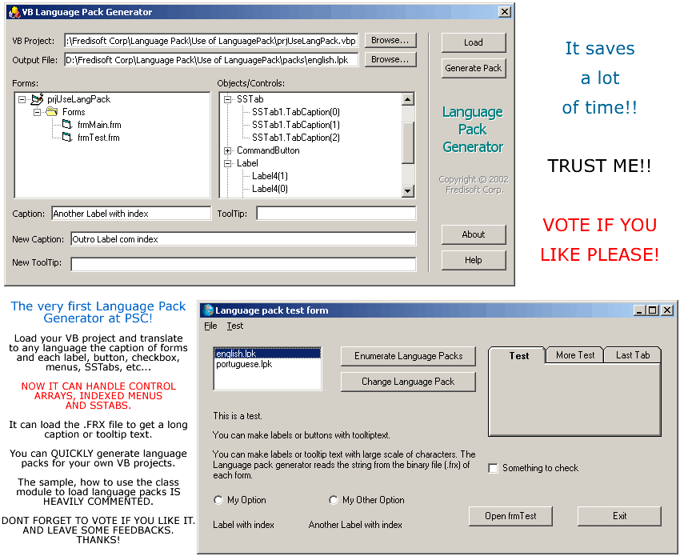



## VB Language Pack Generator 1\.20 \*UPDATED\*

### Description

VB Language Pack Generator is a Powerful and complete application for you to quickly generate language packs to your VB projects. You need to load a project, and translate your labels, menus, buttons, SSTabs, etc... It is able to translate control arrays and indexed menus too.

It can load large captions or tooltips from the binary (.FRX) file of the form. The example, how to use the class module to load language packs is heavly commented. I am thinking in implement it and make it a profissional tool for VB programmers and make it shareware. Vote for me if you like it. Feel free for give me some help to implement it. Thanks!!

UPDATED:

http://www.planet-source-code.com/vb/scripts/ShowCode.asp?txtCodeId=61578&amp;lngWId=1
 
### More Info
 

             |
---                |---
**Submitted On**   |2002-10-06 23:57:58
**By**             |[Frederico Machado](https://github.com/Planet-Source-Code/PSCIndex/blob/master/ByAuthor/frederico-machado.md)
**Level**          |Beginner
**User Rating**    |4.9 (292 globes from 60 users)
**Compatibility**  |VB 6\.0
**Category**       |[Complete Applications](https://github.com/Planet-Source-Code/PSCIndex/blob/master/ByCategory/complete-applications__1-27.md)
**World**          |[Visual Basic](https://github.com/Planet-Source-Code/PSCIndex/blob/master/ByWorld/visual-basic.md)
**Archive File**   |[VB\_Languag155505352003\.zip](https://github.com/Planet-Source-Code/frederico-machado-vb-language-pack-generator-1-20-updated__1-43777/archive/master.zip)

